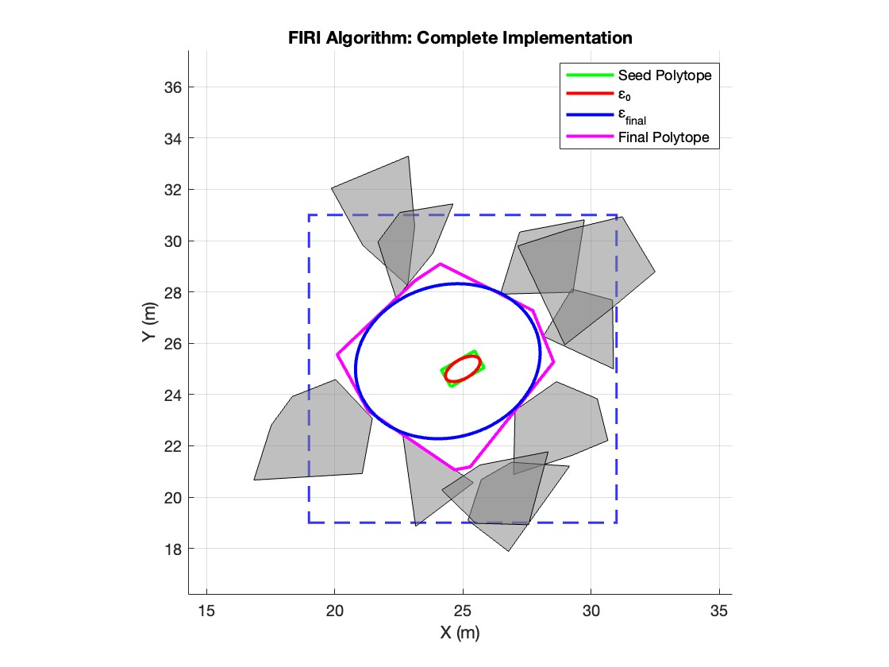

### Implementation 

Run the code blocks in the MATLAB File ()

### Abstract  

Scalable autonomous robots and self driving cars are finally a reality and this has only been possible due to the intense research and development of various algorithms for major autonomy problems like safe motion planning, collision avoidance, sensor data filtering, localization and mapping, learning dynamics through reinforcement learning, and the list goes on. For example, in systems like self-driving cars where real cars carry real people on real roads and have to drive autonomously, safety becomes the biggest challenge and no amount of redundancy in safety is enough to ensure safe autonomy. Hence, researchers across the world have contributed to various geometrical and dynamical techniques to solve the problem of safe driving of robots in challenging environments in the absence of a global positioning system. One such algorithm is the Fast Iterative Region Inflation (FIRI in short) proposed by Wang et al. and his fellow researchers at Zhejiang University, where they propose a novel formulation for solving high quality and computationally efficient obstacle-free convex regions for cluttered 2D and 3D environments. This becomes crucial in efficiently running obstacle avoidance and whole body planning on the robot in cluttered environments like forests, or pushing the boundaries of autonomous racing cars where high speed and precision becomes crucial in pushing the boundaries of high speed navigation in a safety reinforced manner. In this project, I propose the 2D Implementation of FIRI algorithm with essential modules implemented in MATLAB, using a new optimization solver and benchmark against the work when compared to the proposed solver and results in the original paper.

### Mathematical Formulation 

### Sample Output

